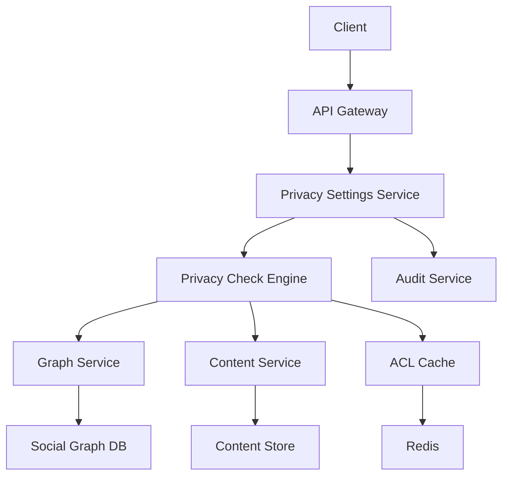
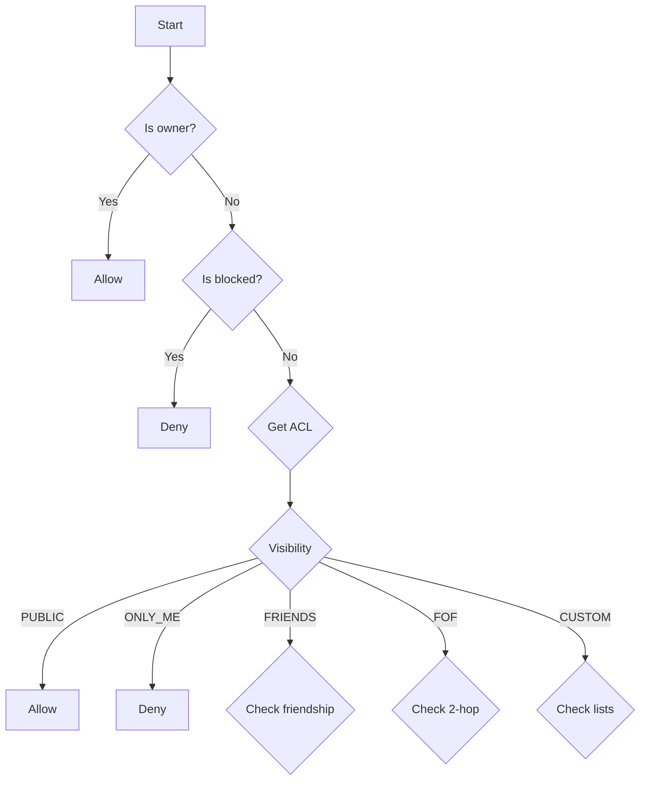
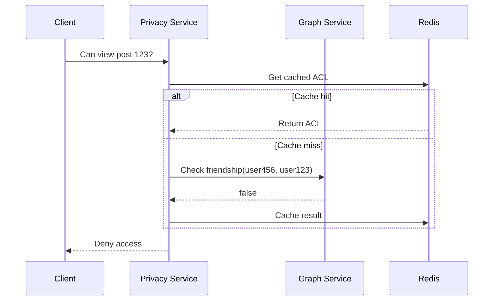

# Facebook Privacy Settings - Comprehensive System Design (Staff-Level)

---

## Table of Contents
1. [Problem Statement](#1-problem-statement)
2. [Requirements](#2-requirements)
3. [Non-Functional Requirements](#3-non-functional-requirements)
4. [Core Challenges](#4-core-challenges)
5. [High-Level Architecture](#5-high-level-architecture)
6. [Data Modeling](#6-data-modeling)
7. [Privacy Access Control Engine](#7-privacy-access-control-engine)
8. [Caching Strategy](#8-caching-strategy)
9. [Consistency & Freshness](#9-consistency--freshness)
10. [Security & Abuse Prevention](#10-security--abuse-prevention)
11. [Extensibility](#11-extensibility)
12. [Trade-offs](#12-trade-offs)
13. [Operational Considerations](#13-operational-considerations)
14. [Diagrams](#14-diagrams)
15. [Mock Interview Q&A](#15-mock-interview-qa)

---

## 1. Problem Statement
Design a privacy settings system for Facebook that:
- Enables granular control over content visibility (posts, profile info, photos)
- Scales to billions of users and trillions of content items
- Maintains low-latency access checks while supporting complex policies
- Handles real-time updates to privacy settings and social graph changes

---

## 2. Requirements

### Functional Requirements
- **Multi-level controls**:
  - Global defaults (account-level)
  - Content-type defaults (all posts vs all photos)
  - Per-entity overrides (individual posts)
- **Visibility options**:
  - `PUBLIC`, `FRIENDS`, `FRIENDS_OF_FRIENDS`, `ONLY_ME`, `CUSTOM`
  - "Friends except..." and "Specific friends" lists
- **Dynamic management**:
  - Create/manage friend lists ("Close Friends", "Work Colleagues")
  - Block/restrict users
  - Retroactive application of privacy changes
- **Real-time enforcement**:
  - Immediate effect for privacy setting changes
  - Near real-time propagation for social graph changes

### Use Cases
1. User posts content with inherited privacy settings
2. User edits privacy for existing content
3. Viewer attempts to access content with permission evaluation
4. User modifies friend relationships affecting existing content visibility

---

## 3. Non-Functional Requirements
| Requirement          | Target                  | Rationale                          |
|----------------------|-------------------------|------------------------------------|
| Availability         | 99.99%                  | Privacy is mission-critical        |
| Read Latency         | <100ms p99              | Smooth user experience             |
| Write Latency        | <500ms p99              | Responsive settings changes        |
| Throughput           | 100K QPS minimum        | Global scale requirements          |
| Consistency          | Strong for writes       | Prevent privacy violations         |
| Audit Retention      | 7 years minimum         | Compliance requirements            |

---

## 4. Core Challenges
1. **Expressive Policies**: Supporting complex boolean logic (Friends AND NOT Colleagues)
2. **Graph Traversal**: Efficiently evaluating friends-of-friends at scale
3. **Freshness vs Performance**: Balancing immediate updates with system load
4. **Content Velocity**: Handling privacy checks for high-volume content creation
5. **Retroactive Changes**: Applying updates to historical content efficiently

---

## 5. High-Level Architecture



Key Components:
1. **Privacy Settings Service**: Manages CRUD operations for privacy configurations
2. **Privacy Check Engine**: Evaluates access requests against policies
3. **Graph Service**: Provides real-time social graph data
4. **ACL Cache**: Fast access to precomputed permissions
5. **Audit Service**: Tracks all privacy-related changes

---

## 6. Data Modeling

### Core Tables
```sql
-- Privacy Settings
CREATE TABLE privacy_settings (
    id UUID PRIMARY KEY,
    user_id UUID,
    entity_type ENUM('post','photo','profile','story'),
    entity_id UUID, -- NULL for default settings
    visibility ENUM('PUBLIC','FRIENDS','FOF','ONLY_ME','CUSTOM'),
    allow_list_id UUID, -- For CUSTOM visibility
    deny_list_id UUID, -- For "except" cases
    version INT,
    created_at TIMESTAMP,
    updated_at TIMESTAMP,
    INDEX (user_id, entity_type)
) PARTITION BY HASH(user_id);

-- Friend Lists
CREATE TABLE friend_lists (
    list_id UUID PRIMARY KEY,
    user_id UUID,
    name VARCHAR(255),
    INDEX (user_id)
);

-- List Memberships (Denormalized for performance)
CREATE TABLE list_memberships (
    list_id UUID,
    member_id UUID,
    PRIMARY KEY (list_id, member_id)
) PARTITION BY HASH(list_id);

-- Blocked Users
CREATE TABLE blocked_users (
    user_id UUID,
    blocked_id UUID,
    created_at TIMESTAMP,
    PRIMARY KEY (user_id, blocked_id)
) PARTITION BY HASH(user_id);
```

### Denormalized ACL Store (Redis)
```json
{
  "acl:post:12345": {
    "owner": "user678",
    "visibility": "CUSTOM",
    "allowed": ["user123", "user456"],
    "denied": ["user789"],
    "version": 3,
    "ttl": 3600
  }
}
```

---

## 7. Privacy Access Control Engine

### Evaluation Flowchart


Optimizations:
- **Lazy Evaluation**: For FOF checks, use cached results when possible
- **Short-circuiting**: Fail fast on block lists or ONLY_ME cases
- **Batching**: Process multiple items in single graph queries
- **Bloom Filters**: Efficiently check list membership for large groups

---

## 8. Caching Strategy

### Multi-Layer Caching
1. **Local Cache** (Per server, 1s TTL)
   - Ultra-fast for hot content
   - Invalidated via pub/sub
2. **Distributed Cache** (Redis, 5m TTL)
   - Shared across cluster
   - Write-through pattern for consistency
3. **Persistent Cache** (DynamoDB)
   - Fallback for cache misses
   - Async updates via event stream

### Cache Key Design
```
acl:{entity_type}:{entity_id}:v{version}
user:{user_id}:friends:version
list:{list_id}:members:version
```

---

## 9. Consistency & Freshness

### Consistency Matrix
| Operation               | Consistency  | Mechanism                          |
|-------------------------|--------------|------------------------------------|
| Privacy setting update  | Strong       | Linearizable writes                |
| Friend list change      | Eventual     | Async graph propagation            |
| ACL reads               | Eventual     | Cache with versioning              |
| Block list checks       | Strong       | Direct DB read                     |

### Update Propagation
1. Write to primary datastore
2. Publish change event to Kafka
3. Consumers update:
   - ACL cache
   - Graph service indices
   - Search indexes

---

## 10. Security & Abuse Prevention

### Protection Measures
1. **Rate Limiting**:
   - 5 privacy changes/second per user
   - Bulk changes via async jobs
2. **Audit Trail**:
   - Immutable log of all changes
   - Cryptographic signatures
3. **Validation**:
   - Schema validation for policies
   - Cycle detection in block lists
4. **Encryption**:
   - Sensitive fields encrypted at rest
   - TLS for all communications

---

## 11. Extensibility

### Plugin Architecture
```python
class VisibilityPlugin:
    def evaluate(self, viewer, content) -> bool

# Example plugins:
- GeographicPlugin (location-based)
- TemporalPlugin (time-limited visibility)
- DemographicPlugin (age/group restrictions)
```

### Policy DSL Example
```json
{
  "operator": "AND",
  "conditions": [
    { "type": "friendship" },
    { 
      "type": "list_membership",
      "list": "close_friends",
      "negate": true
    }
  ]
}
```

---

## 12. Trade-offs

### Evaluation Strategies
| Approach          | Pros                  | Cons                  |
|-------------------|-----------------------|-----------------------|
| Pre-computed ACLs | Fast reads            | High write overhead   |
| Real-time eval    | Fresh results         | Latency spikes        |
| Hybrid            | Balanced performance  | System complexity     |

Selected: **Hybrid Approach**
- Pre-compute for common cases (PUBLIC, FRIENDS)
- Real-time for complex policies (CUSTOM, FOF)

---

## 13. Operational Considerations

### Critical Metrics
1. **Privacy check latency** (p95 < 200ms)
2. **ACL build backlog** (alert if > 1k items)
3. **Cache hit rate** (target > 90%)
4. **Error rates** (alert if > 0.1%)

### Disaster Recovery
1. **Backfill pipeline**: Rebuild ACLs from event log
2. **Degraded mode**: Fallback to stricter privacy
3. **Regional failover**: Multi-region deployment

---

## 14. Diagrams

### Sequence Diagram: Post Visibility Check


---

## 15. Mock Interview Q&A

**Q: How would you redesign if we needed to support "Friends who went to same school"?**

> **Answer**: 
> 1. Extend data model with education history
> 2. Create materialized view of "school friends"
> 3. Add new visibility type "SCHOOL_FRIENDS"
> 4. Implement background job to maintain relationships
> 5. Add caching layer for school affiliations

**Q: How to handle a celebrity with 50M followers posting content?**

> **Answer**:
> 1. Special-case handling for high-fanout users
> 2. Skip fanout for PUBLIC content
> 3. Use probabilistic data structures for checks
> 4. Tiered caching (edge caches for hot content)
> 5. Rate limit privacy changes for these accounts

**Q: What would you monitor in production?**

> **Answer**:
> 1. ACL build latency distribution
> 2. Cache hit/miss ratios by region
> 3. Graph traversal depth statistics
> 4. Error rates by failure type
> 5. Privacy change reversal patterns

---

## Final Recommendations

1. **Phase 1**: Implement core ACL system with basic visibility levels
2. **Phase 2**: Add custom lists and retroactive changes
3. **Phase 3**: Introduce advanced policy engine and plugins
4. **Continuous**: Monitor and optimize hot paths

**Key Insights**:
- Privacy systems require careful balance between flexibility and performance
- Hybrid evaluation strategies work best at scale
- Versioning is critical for consistent updates
- Comprehensive auditing is non-negotiable
